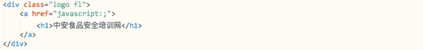
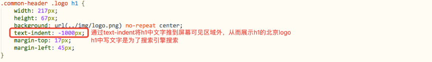
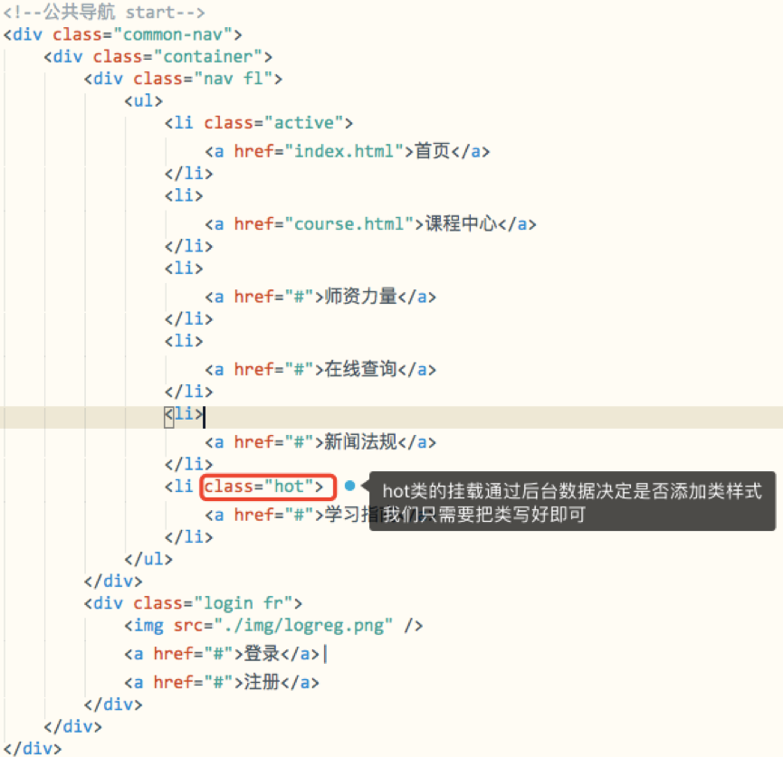
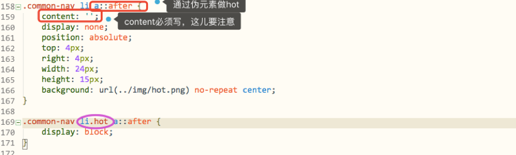
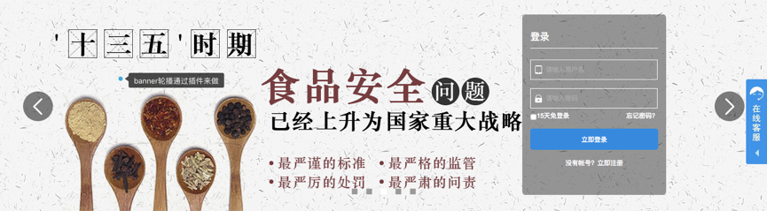
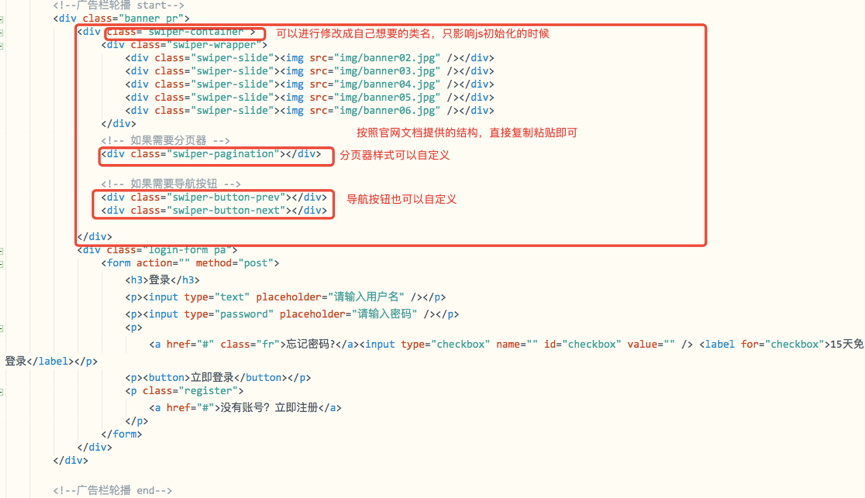
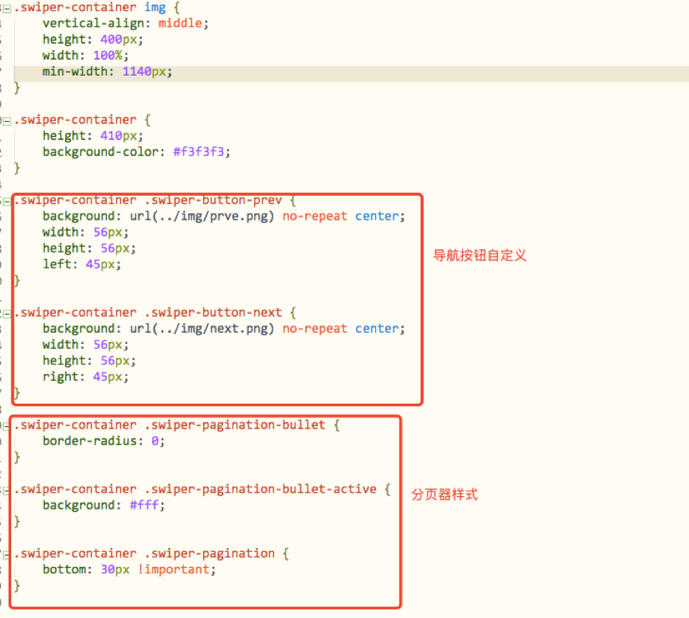
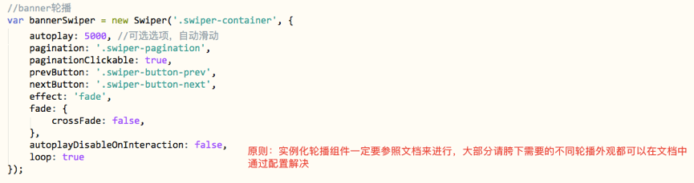

# 中安食品安全培训网
***

## 文档说明
> 本文档针对线上真实网站进行讲解，侧重方向为具体功能点实现，插件的使用，解决学员在接手项目后如何快速开发以及各类插件的提供使用（正常简单的功能将会省略），最后会提供源码

## 项目名称
> [中安汇金](http://www.chinafhse.org/)

## 项目依赖
+ jquery
+ swiper
+ pagination
+ additional-methods

##	首页项目实施

### 首页头部功能
1. 原型
	
2. 头部实现
	
3. HTML
	
4. CSS
	
	
### 首页导航功能
1. 导航实现
	
2. HTML
	
3. CSS
	

### 首页广告栏功能
1. banner实现
	
2. HTML
	
3. CSS
	
4. JS
	
5. swiper：[链接地址](http://www.swiper.com.cn/api/index.html)

``` JS
	//上述参数详解(所有参数均可在文档中查找，都有详细讲解)
	autoplay:5000,						//轮播自动开始
	pagination:'.swiper-pagination',	//初始化分页器，轮播底部的小圆点
	paginationClickable:true,			//开启分页器功能，通过分页器可以控制轮播
	prevButton:'.swiper-button-prev',	//初始化上一页按钮
	nextButton:'.swiper-button-next',	//初始化下一页按钮
	effect:'fade',						//修改轮播默认样式(从右向左滑动)，改为淡入淡出
	fade:{crossFade:fase},				//关闭淡出，也是默认值，可省略不写
	autoplayDisableOnInteraction:false,	//用户操作过轮播图后继续工作，改为true则停止
	loop:true,							//开启环路，让轮播图看起来是循环的
```

